# YouTube-Channel-Analytics-and-Insight-Generation-using-Python
A Data Analytics Project
# Data Preprocessing Report — YouTube Channel Analytics

**Dataset:** Global YouTube Statistics  
**Tool:** Python (pandas, numpy)  
**Source File:** `data_preprocessing.py`  
**Input:** `GlobalYouTubeStatistics.csv` (1,006 rows × 29 columns)  
**Output:** `GlobalYouTubeStatistics_Cleaned.csv` (978 rows × 46 columns)

---
# Dashboard Preview

## Interactive Dashboard Screenshots

<p align="center">
  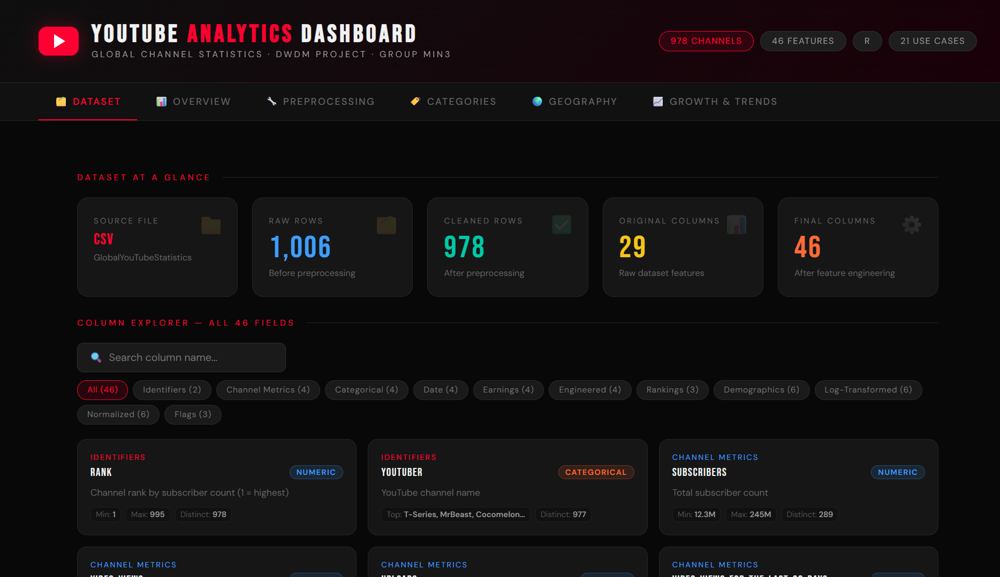<br><br>
  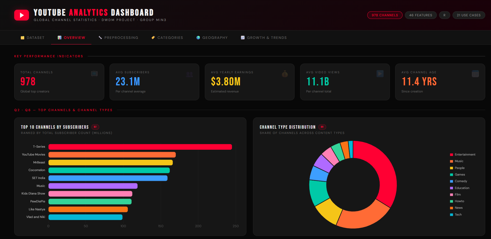<br><br>
  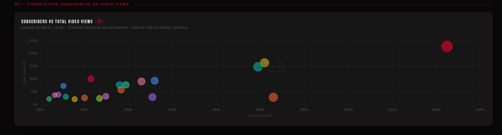<br><br>
  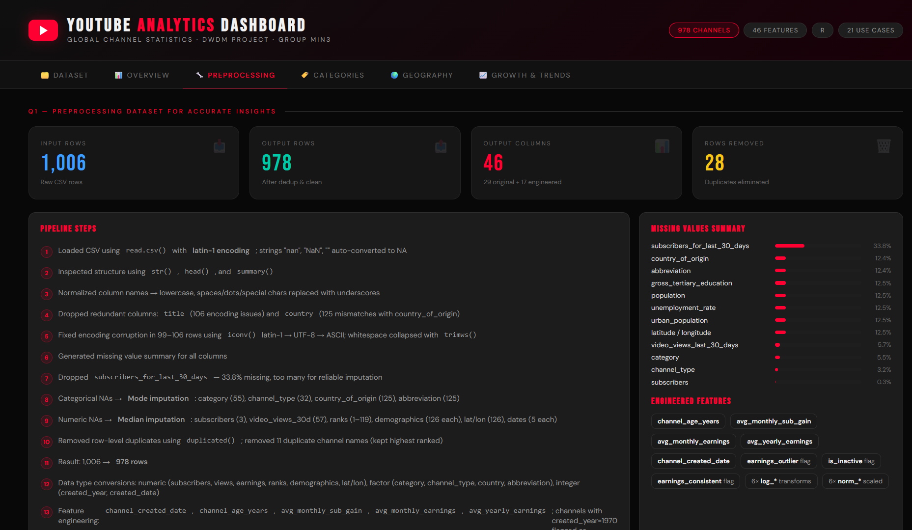<br><br>
  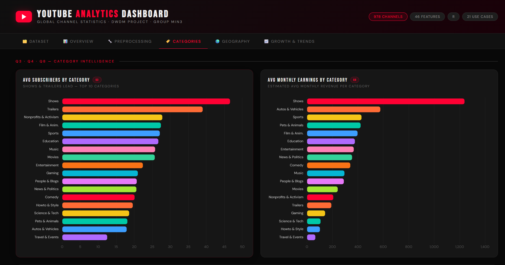<br><br>
  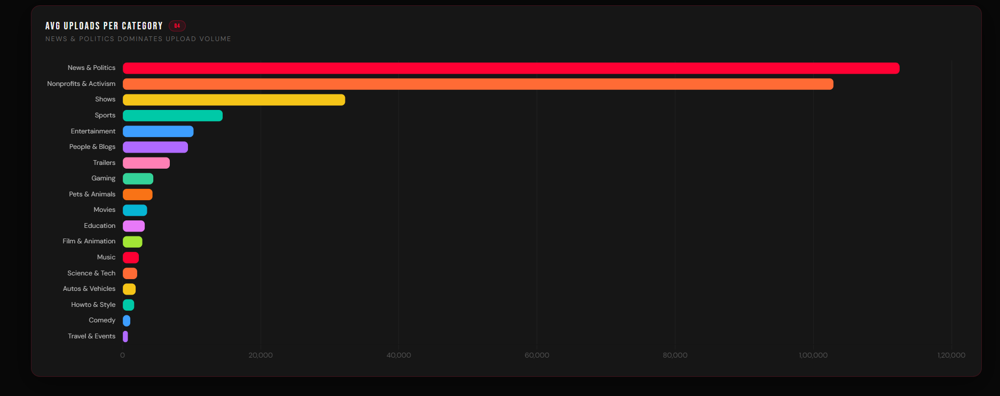<br><br>
  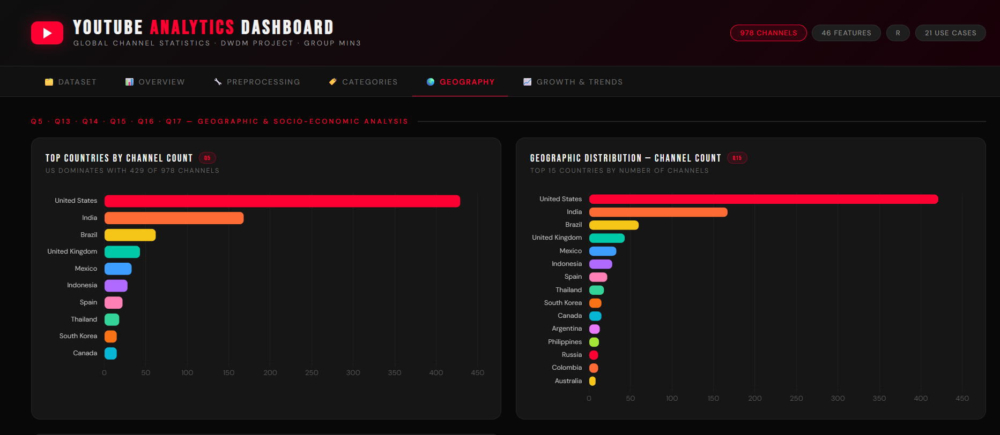<br><br>
  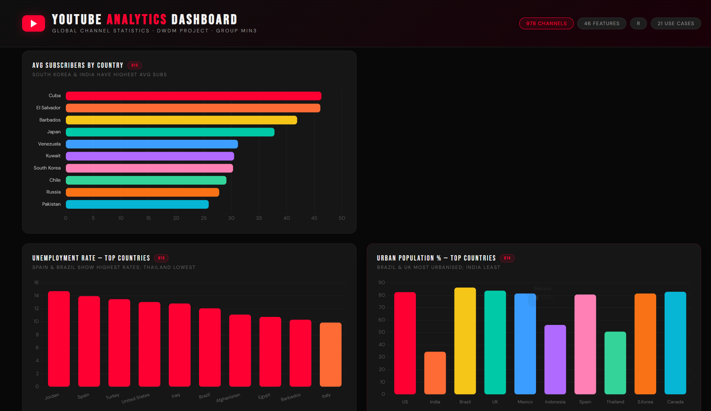<br><br>
  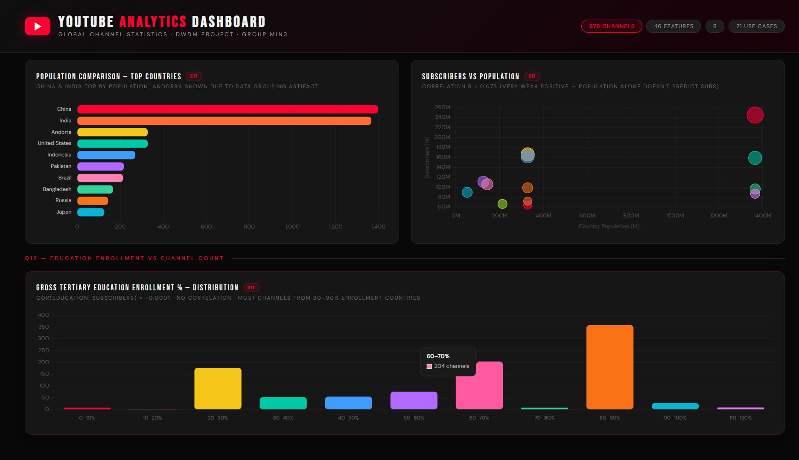<br><br>
  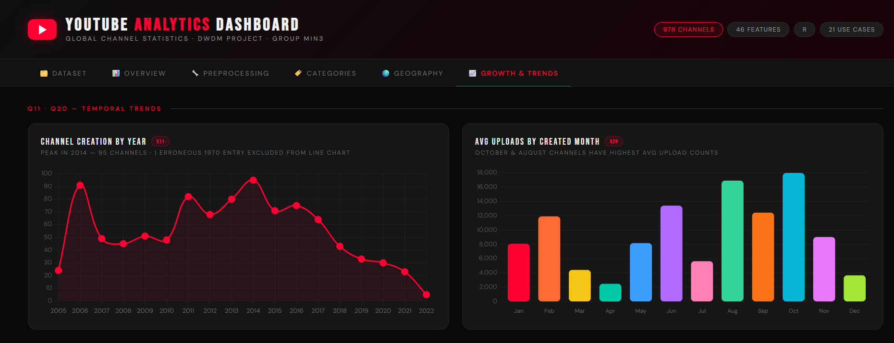<br><br>
  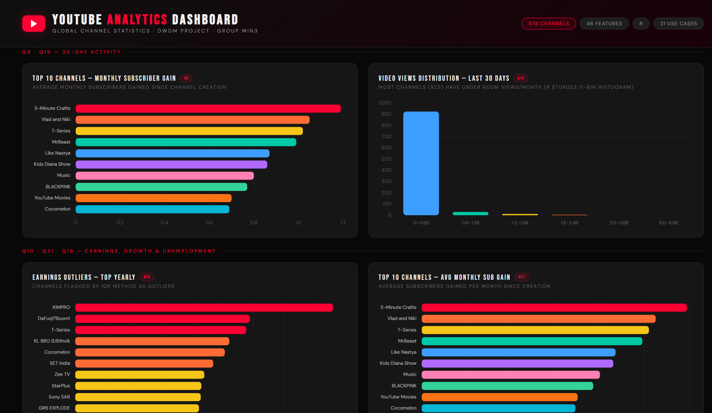<br><br>
  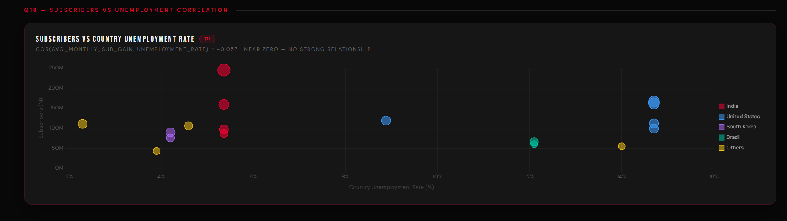
</p>

---

## 1. Loading the Dataset

- Loaded the CSV file using `pd.read_csv()` with **latin-1 encoding** (UTF-8 had known issues with this dataset).
- Strings like `"nan"`, `"NaN"`, and empty strings were automatically converted to `NaN` during loading via `na_values`.

```python
df = pd.read_csv(
    "GlobalYouTubeStatistics.csv",
    encoding="latin1",
    na_values=["", "nan", "NaN", "NA"]
)
```

---

## 2. Dataset Inspection

- Used `df.info()` to view column types and structure.
- Used `df.head()` to preview the first 5 rows.
- Used `df.describe(include="all")` to generate summary statistics for all columns.

---

## 3. Column Name Normalization

All column names were standardized for consistency using pandas string methods:
- Converted to **lowercase**
- Replaced spaces, dots, and special characters with **underscores**
- Removed leading/trailing underscores and collapsed multiple underscores

| Before | After |
|--------|-------|
| `Youtuber` | `youtuber` |
| `video views` | `video_views` |
| `Country of origin` | `country_of_origin` |
| `Gross tertiary education enrollment (%)` | `gross_tertiary_education_enrollment___` |

---

## 4. Dropping Redundant Columns

Two columns were removed using `df.drop()`:

| Column | Reason |
|--------|--------|
| `title` | Redundant with `youtuber`; had 106 rows with encoding issues |
| `country` | Redundant with `country_of_origin`; had inconsistent casing and 125 mismatches |

---

## 5. Fixing Encoding Corruption

- **99–106 rows** had corrupted characters (ý, ï, ¿, Â, etc.) in text columns.
- Applied a custom `fix_encoding()` function using Python's `.encode()` / `.decode()` with `errors="ignore"` to strip non-ASCII artifacts.
- Collapsed extra whitespace using `re.sub()` and `.strip()`.

---

## 6. Missing Values Analysis

A summary of missing values was generated using `df.isnull().sum()` and `df.isnull().mean()`:

| Column | Missing Count | Missing % |
|--------|--------------|-----------|
| `subscribers_for_last_30_days` | 340 | 33.80% |
| `country_of_origin` | 125 | 12.43% |
| `abbreviation` | 125 | 12.43% |
| `gross_tertiary_education_enrollment` | 126 | 12.52% |
| `population` | 126 | 12.52% |
| `unemployment_rate` | 126 | 12.52% |
| `urban_population` | 126 | 12.52% |
| `latitude` / `longitude` | 126 | 12.52% |
| `video_views_for_the_last_30_days` | 57 | 5.67% |
| `category` | 55 | 5.47% |
| `channel_type` | 32 | 3.18% |
| `subscribers` | 3 | 0.30% |

---

## 7. Handling Missing Values

### 7a. Dropped High-Missing Column
- **`subscribers_for_last_30_days`** (33.8% missing) — dropped entirely using `df.drop()` as too many values are missing for reliable imputation.

### 7b. Categorical Columns → Mode Imputation
Filled missing values with the **most frequent value (mode)** using a custom `get_mode()` function and `fillna()`:

| Column | NAs Filled | Mode Used |
|--------|-----------|-----------|
| `category` | 55 | Entertainment |
| `channel_type` | 32 | Entertainment |
| `country_of_origin` | 125 | United States |
| `abbreviation` | 125 | US |

### 7c. Numeric Columns → Median Imputation
Filled missing values with the **median** (robust to outliers) using `series.median()` and `fillna()`:

| Column | NAs Filled |
|--------|-----------|
| `subscribers` | 3 |
| `video_views_for_the_last_30_days` | 57 |
| `video_views_rank` | 1 |
| `country_rank` | 119 |
| `channel_type_rank` | 35 |
| `gross_tertiary_education_enrollment` | 126 |
| `population` | 126 |
| `unemployment_rate` | 126 |
| `urban_population` | 126 |
| `latitude` / `longitude` | 126 |
| `created_year` / `created_date` | 5 each |

---

## 8. Removing Duplicates

- **Row-level duplicates**: Checked using `df.duplicated()` and removed with `df.drop_duplicates()`.
- **Duplicate channel names**: 11 duplicate `youtuber` names were found. Kept the first occurrence (highest ranked) using `drop_duplicates(subset="youtuber", keep="first")`.
- **Result**: Row count reduced from 1,006 → **978 rows**.

---

## 9. Data Type Conversions

| Conversion | Columns |
|-----------|---------|
| **→ Numeric** (`pd.to_numeric`) | `subscribers`, `video_views`, `uploads`, `video_views_for_the_last_30_days`, all earnings columns, ranking columns, demographics, lat/long |
| **→ Category** (`.astype("category")`) | `category` (18 levels), `channel_type` (14 levels), `country_of_origin` (49 levels), `abbreviation` (49 levels) |
| **→ Integer** (`Int64`) | `created_year`, `created_date` |

---

## 10. Feature Engineering

Five new columns were created:

| New Column | Formula | Purpose |
|-----------|---------|---------|
| `channel_created_date` | Combined `created_year` + `created_month` + `created_date` via `pd.to_datetime()` | Single datetime column |
| `channel_age_years` | `(today - channel_created_date).dt.days / 365.25` | Channel age in years |
| `avg_monthly_sub_gain` | `subscribers / (channel_age_years × 12)` | Growth rate metric |
| `avg_monthly_earnings` | `(lowest + highest monthly) / 2` | Earnings midpoint |
| `avg_yearly_earnings` | `(lowest + highest yearly) / 2` | Earnings midpoint |

> **Note:** Channels with `created_year = 1970` were flagged as erroneous and set to `NaT` using boolean masking.

---

## 11. Log Transformations

Applied `np.log1p(x)` = log(1 + x) to handle **skewed distributions** and zero values:

| Original Column | New Column |
|-----------------|-----------|
| `subscribers` | `log_subscribers` |
| `video_views` | `log_video_views` |
| `uploads` | `log_uploads` |
| `video_views_for_the_last_30_days` | `log_video_views_for_the_last_30_days` |
| `avg_monthly_earnings` | `log_avg_monthly_earnings` |
| `avg_yearly_earnings` | `log_avg_yearly_earnings` |

---

## 12. Outlier Detection (IQR Method)

Used the **Interquartile Range (IQR)** method via a custom `detect_outliers()` function:  
- Lower bound = Q1 − 1.5 × IQR  
- Upper bound = Q3 + 1.5 × IQR

| Column | Outliers Detected |
|--------|------------------|
| `subscribers` | 81 |
| `video_views` | ~70+ |
| `uploads` | ~40+ |
| `avg_yearly_earnings` | ~90+ |

- Created a boolean flag column **`earnings_outlier`** (`True`/`False`) for yearly earnings outliers using `series.quantile()`.

---

## 13. Zero Value Investigation

| Metric | Count |
|--------|-------|
| Channels with 0 video views | 9 |
| Channels with 0 uploads | 44 |
| Channels with $0 earnings | 90–119 |

- Created a boolean flag **`is_inactive`** for channels with zero uploads OR zero views using `np.where` / boolean masking.

---

## 14. Min-Max Normalization

Applied Min-Max scaling (0 to 1 range) via a custom `min_max_scale()` function:

| Original | Normalized Column |
|----------|------------------|
| `subscribers` | `norm_subscribers` |
| `video_views` | `norm_video_views` |
| `uploads` | `norm_uploads` |
| `video_views_rank` | `norm_video_views_rank` |
| `country_rank` | `norm_country_rank` |
| `channel_type_rank` | `norm_channel_type_rank` |

---

## 15. Earnings Consistency Check

Verified whether `yearly_earnings ≈ monthly_earnings × 12`:
- Created boolean column **`earnings_consistent`** using `abs()` comparison for rows passing this check.

---

## 16. Final Summary

| Metric | Value |
|--------|-------|
| **Final Rows** | 978 |
| **Final Columns** | 46 |
| **Remaining NAs** | Minimal (only in derived date columns for erroneous 1970 entries) |

---

## 17. Export

The fully cleaned and preprocessed dataset was saved using `df.to_csv()`:

```python
df.to_csv("GlobalYouTubeStatistics_Cleaned.csv", index=False)
```

---

## Dependencies

```
pandas
numpy
```

Install with:
```bash
pip install pandas numpy
```

---

## Column Groups in Final Dataset

| Group | Columns |
|-------|---------|
| **Identifiers** | `rank`, `youtuber` |
| **Channel Metrics** | `subscribers`, `video_views`, `uploads`, `video_views_for_the_last_30_days` |
| **Earnings** | `lowest/highest_monthly/yearly_earnings`, `avg_monthly_earnings`, `avg_yearly_earnings` |
| **Categorical** | `category`, `channel_type`, `country_of_origin`, `abbreviation` |
| **Rankings** | `video_views_rank`, `country_rank`, `channel_type_rank` |
| **Date** | `created_year`, `created_month`, `created_date`, `channel_created_date` |
| **Demographics** | `population`, `unemployment_rate`, `urban_population`, `gross_tertiary_education_enrollment`, `latitude`, `longitude` |
| **Engineered** | `channel_age_years`, `avg_monthly_sub_gain` |
| **Log-Transformed** | `log_subscribers`, `log_video_views`, `log_uploads`, etc. |
| **Normalized** | `norm_subscribers`, `norm_video_views`, `norm_uploads`, etc. |
| **Flags** | `earnings_outlier`, `is_inactive`, `earnings_consistent` |
